# RP6502 Emulator — Test Pattern Gallery

*2026-02-25T02:33:58Z by Showboat 0.6.1*
<!-- showboat-id: cf9dd109-2240-41a4-b2ca-3d673cebe593 -->

This document showcases all built-in test patterns for the RP6502 Picocomputer emulator. Screenshots are generated headlessly via the `screenshot` subcommand. Modes cover Mode 3 bitmap (1/2/4/8/16 bpp, multiple canvas sizes), the Mandelbrot benchmark, Mode 1 character modes, and Multi-Plane.

## Mode 3 Bitmap — Monochrome (1 bpp)

1 bpp uses a 2-entry palette (black/white). Four canvas sizes are supported. 320-wide canvases are pixel-doubled horizontally to fill the 640×480 display.

```bash
../emu/target/release/rp6502-emu screenshot --mode mono640x480 -o demo-screenshots/mono640x480.png && echo OK
```

```output
Screenshot saved to demo-screenshots/mono640x480.png
OK
```

```bash {image}

```


```bash
../emu/target/release/rp6502-emu screenshot --mode mono640x360 -o demo-screenshots/mono640x360.png && echo OK
```

```output
Screenshot saved to demo-screenshots/mono640x360.png
OK
```

```bash {image}

```


```bash
../emu/target/release/rp6502-emu screenshot --mode mono320x240 -o demo-screenshots/mono320x240.png && echo OK
```

```output
Screenshot saved to demo-screenshots/mono320x240.png
OK
```

```bash {image}
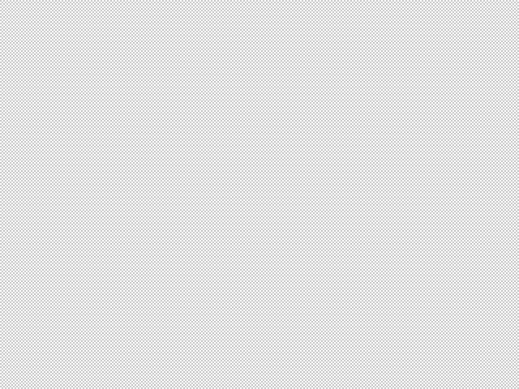
```


```bash
../emu/target/release/rp6502-emu screenshot --mode mono320x180 -o demo-screenshots/mono320x180.png && echo OK
```

```output
Screenshot saved to demo-screenshots/mono320x180.png
OK
```

```bash {image}
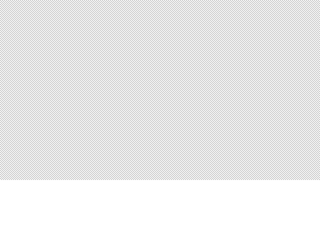
```


## Mode 3 Bitmap — 2 bpp (4 colors)

2 bpp packs 4 pixels per byte. The test pattern cycles through the 4-color ANSI palette across three canvas sizes.

```bash
../emu/target/release/rp6502-emu screenshot --mode color2bpp640x360 -o demo-screenshots/color2bpp640x360.png && echo OK
```

```output
Screenshot saved to demo-screenshots/color2bpp640x360.png
OK
```

```bash {image}
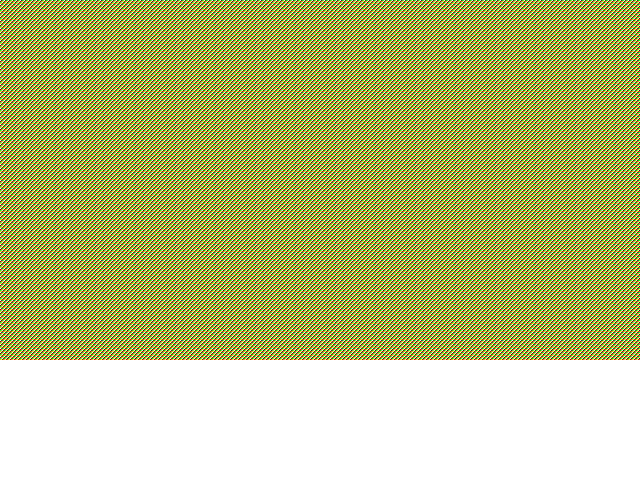
```


```bash
../emu/target/release/rp6502-emu screenshot --mode color2bpp320x240 -o demo-screenshots/color2bpp320x240.png && echo OK
```

```output
Screenshot saved to demo-screenshots/color2bpp320x240.png
OK
```

```bash {image}
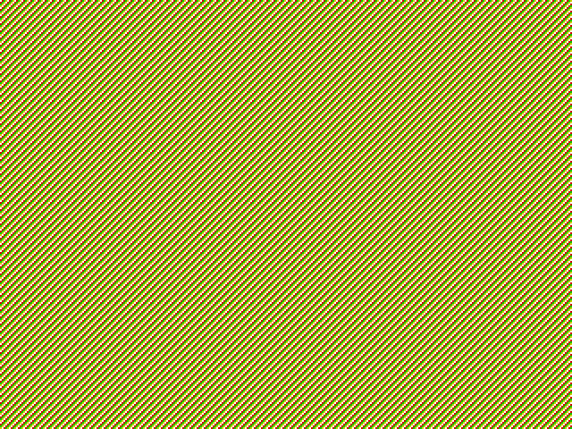
```


```bash
../emu/target/release/rp6502-emu screenshot --mode color2bpp320x180 -o demo-screenshots/color2bpp320x180.png && echo OK
```

```output
Screenshot saved to demo-screenshots/color2bpp320x180.png
OK
```

```bash {image}

```

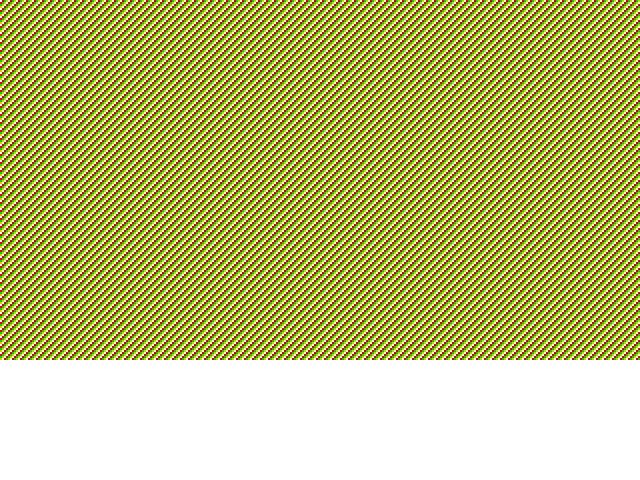

## Mode 3 Bitmap — 4 bpp (16 colors)

4 bpp uses a 16-entry ANSI palette. Two canvas sizes.

```bash
../emu/target/release/rp6502-emu screenshot --mode color4bpp320x240 -o demo-screenshots/color4bpp320x240.png && echo OK
```

```output
Screenshot saved to demo-screenshots/color4bpp320x240.png
OK
```

```bash {image}

```

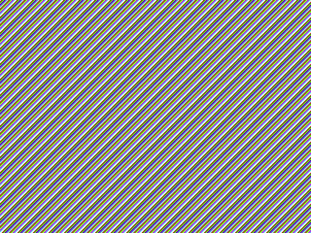

```bash
../emu/target/release/rp6502-emu screenshot --mode color4bpp320x180 -o demo-screenshots/color4bpp320x180.png && echo OK
```

```output
Screenshot saved to demo-screenshots/color4bpp320x180.png
OK
```

```bash {image}

```


## Mode 3 Bitmap — 8 bpp (256 colors)

8 bpp maps each pixel byte directly into the 256-entry ANSI palette.

```bash
../emu/target/release/rp6502-emu screenshot --mode color8bpp320x180 -o demo-screenshots/color8bpp320x180.png && echo OK
```

```output
Screenshot saved to demo-screenshots/color8bpp320x180.png
OK
```

```bash {image}

```

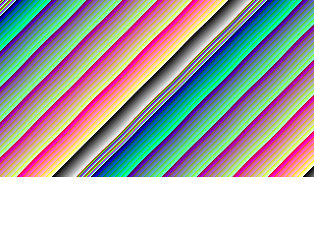

## Mode 3 Bitmap — 16 bpp (direct color)

16 bpp uses the PICO_SCANVIDEO pixel format: R5 at bits 4:0, G5 at bits 10:6, B5 at bits 15:11. The test pattern renders a full-color gradient.

```bash
../emu/target/release/rp6502-emu screenshot --mode color16bpp320 -o demo-screenshots/color16bpp320.png && echo OK
```

```output
Screenshot saved to demo-screenshots/color16bpp320.png
OK
```

```bash {image}
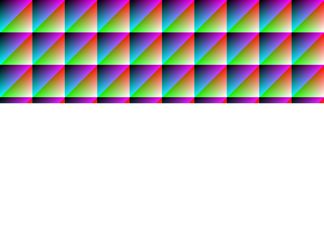
```


## Mandelbrot Benchmark

Pixel-for-pixel replication of `pico-examples/src/mandelbrot.c`. Rendered in Mode 3 4bpp at 320×240 using the ANSI 16-color palette. Used to validate the emulator's XRAM, XREG, and Mode 3 rendering pipeline end-to-end.

```bash
../emu/target/release/rp6502-emu screenshot --mode mandelbrot -o demo-screenshots/mandelbrot.png && echo OK
```

```output
Screenshot saved to demo-screenshots/mandelbrot.png
OK
```

```bash {image}
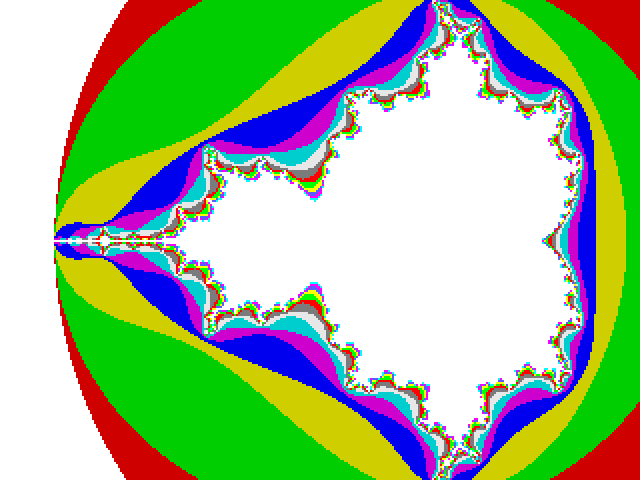
```


## Mode 1 Character — Text 1 bpp (320×240)

Mode 1 renders CP437 character cells from XRAM. In 1bpp mode each glyph pixel is either foreground or background. The test pattern fills the screen with printable ASCII characters.

```bash
../emu/target/release/rp6502-emu screenshot --mode text1bpp320x240 -o demo-screenshots/text1bpp320x240.png && echo OK
```

```output
Screenshot saved to demo-screenshots/text1bpp320x240.png
OK
```

```bash {image}
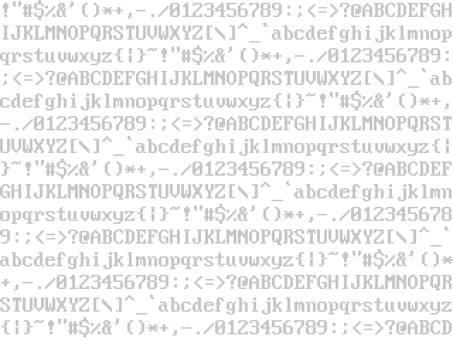
```


## Mode 1 Character — Text 8 bpp (320×240)

8bpp character mode indexes the full 256-entry ANSI palette for both foreground and background, enabling rich colored text.

```bash
../emu/target/release/rp6502-emu screenshot --mode text8bpp320x240 -o demo-screenshots/text8bpp320x240.png && echo OK
```

```output
Screenshot saved to demo-screenshots/text8bpp320x240.png
OK
```

```bash {image}
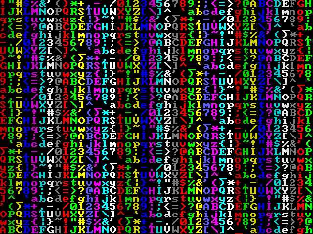
```


## Multi-Plane

Exercises multiple simultaneous VGA planes rendered on the same frame. Combines several modes/layers to validate the VGA thread's plane management and compositing.

```bash
../emu/target/release/rp6502-emu screenshot --mode multi_plane -o demo-screenshots/multi_plane.png && echo OK
```

```output
Screenshot saved to demo-screenshots/multi_plane.png
OK
```

```bash {image}
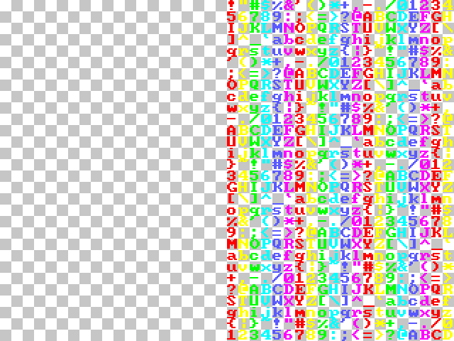
```


